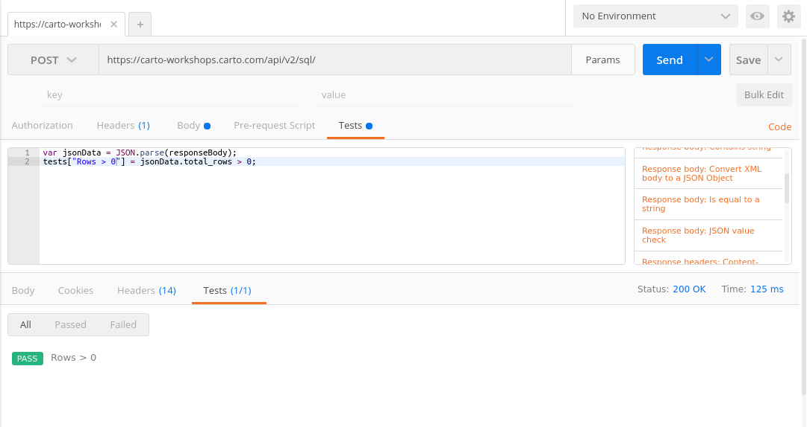
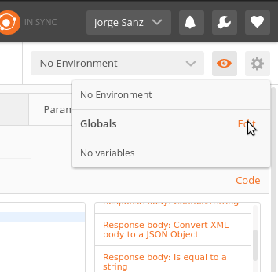
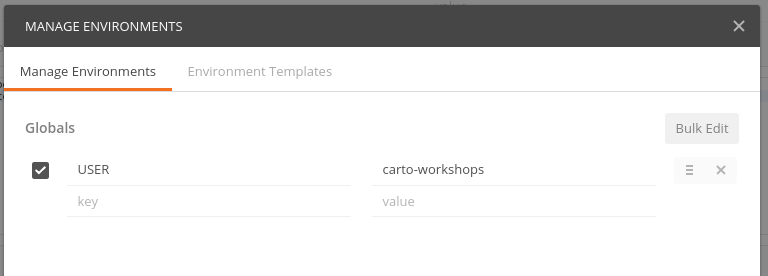
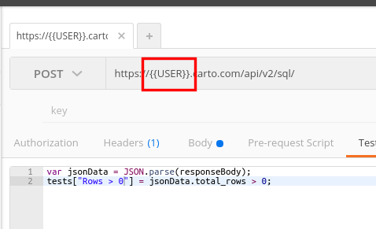

Postman
===================================

Jorge Sanz · jorge@carto.com

2016-12-28


---

<!-- .element class="noborder"-->

* https://www.getpostman.com/
* Desktop application:
  * MacOS, Windows, Chrome Extension
* HTTP Client

---

# Main features

* Supports all HTTP **methods**: `GET`, `POST`, `DELETE`, ...
* Supports **authentication**, **forms**, custom **headers**
* **Organize** calls on collections
* **Parametrize** calls using global or *environments* variables
  * Same collection for different CARTO accounts
* Collections and environments can be **imported/exported**
* **Generate** code from a request
  * `curl`
  * Python, NodeJS
  * And many programming languages

---

# Advanced features

* Run **tests** on results
  * Check properties existence, values, etc
  * Automatically assign variables (environment or global) from a call response
  * Check the provided snippets
* Collection **runner**
* Non free features for **teams**
* CLI client: [newman](https://www.npmjs.com/package/newman)

---

# First test

* `https://carto-workshops.carto.com/api/v2/sql/`
* Click on the `Params` button and add a new parameter:
  * key: `q`
  * value: `SELECT the_geom,name,pop_max from ne_10m_populated_places_simple LIMIT 10`
* Check the results, header response
* Try to change the format with a new parameter `format` to `geojson` or `csv`
* Save this query into a new collection called `Training`

___


---

# A `POST` request

* Select `POST` as the method
* Remove all params
* Go to the `body` section, select `raw` as the type and then put this JSON

```json
{
	"q":"SELECT the_geom,name,pop_max from ne_10m_populated_places_simple LIMIT 10"
}
```
* Select `application/json` on the combo box and check the new header entry

___


---
# Adding a test

* Go to the `Tests` section and put this code
```javascript
var jsonData = JSON.parse(responseBody);
tests["Rows > 0"] = jsonData.total_rows > 0;
```
* Rerun the call and check if the test passes

___



---

# Global variables

Go to the *eye* menu and click on Edit



___

Create a new variable `USER` with value `carto-workshops`



___

Change the URL to use this variable and check if it works



---
# CARTO collection

* Download from [here](.CARTO Collection.postman_collection.json)
* Covers SQL, Maps, Import and Enterprise API
* Needs an [environment](./CARTO Collection.postman_environment.json) with many variables
* Some tests to automatically set variables
* Ernesto is maintaining it in a [repo](https://github.com/ernesmb/CARTO-Engine-collection)

___

# Exercise

Creating a named map and instantiating it

* Check your named maps
* Create a new template: check the auth and details
* Instantiate the template, check the `LAYERGROUPID`
* Use the Static Maps example
  * Reminder: append `?auth_token=carto`


---

Thanks!!
===================================

## Postman

Jorge Sanz · jorge@carto.com

2016-12-28


<!--
RESOURCES

COLORS:

Location Red
#F24440
#FF918F

Navy Blue
#162945

Purple
#C6ACFC
#C6ACFC

Prediction Blue
#1785FB

Green
#73C86B


-->
