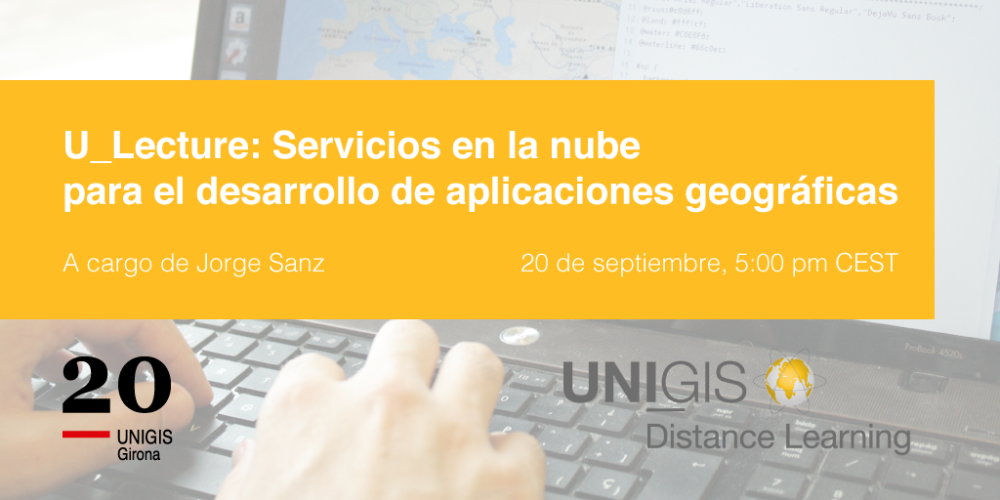
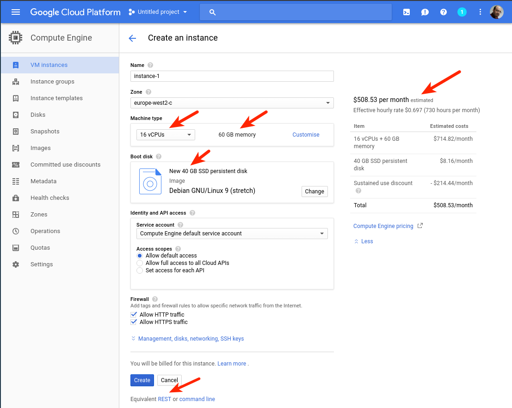
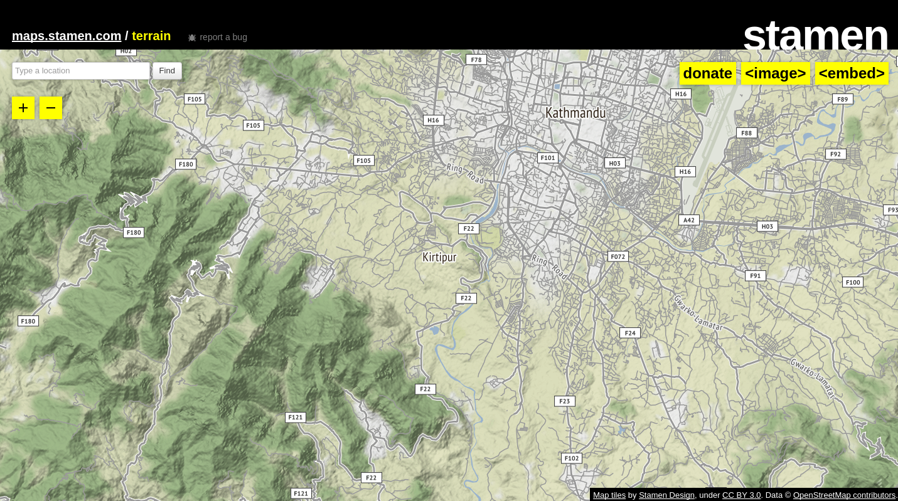

 <!-- .element style="background:white;" -->

Note:

* Presentación
* Dónde trabajo
* Profe del master UNGIS

---
<!-- .element data-background="imgs/clouds/kaushik-panchal-37070.jpg" class="light-background"-->

## Agenda

* *Qué es el cloud computing*
* Infraestructura
* Plataforma
* *Software*

Note:

La estructura de la charla es una primera introducción genérica a qué es el *cloud computing*, por qué es relevante y dos clasificaciones.

---

## ¿Qué es el Cloud Computing?

> Obtención de recursos de computación a demanda, aprovisionados de forma ágil y con mínimo esfuerzo.

---

## Por qué

* Adaptación de recursos a necesidades reales
* Seguridad y recuperación de backups  (para PYMES sobre todo)<!-- .element class="fragment" -->
* Facilidad de actualización de componentes<!-- .element class="fragment" -->
* Facilidad de acceso a recursos<!-- .element class="fragment" -->
* Medio ambiente<!-- .element class="fragment" -->

[fuente](https://www.salesforce.com/uk/blog/2015/11/why-move-to-the-cloud-10-benefits-of-cloud-computing.html)

Note:

* Con la nube podemos adaptar los recursos a nuestra disposición a nuestras necesidades actuales y a corto plazo, de manera que si nuestras condiciones cambian podemos ampliar o reducir esos recursos de forma ágil.

* En las PYMES la entrada de las tecnologías en la nube ha facilitado el acceso a sistemas de *backup* y recuperación de datos antes solo disponibles a grandes corporaciones con departamentos de sistemas capaces de gestionar este tipo de situaciones.

* En los servicios de *software* en la nube las actualizaciones (nuevas funcionalidades y también mejoras) se despliegan frecuentemente y quedan accesibles automáticamente. Por supuesto para nuevas versiones de APIs los desarrolladores tienen que migrar sus aplicaciones pero el ahorro de tiempo y costes es enorme.

* En los servicios en la nube los recursos (máquinas, software, bases de datos, documentos) son ubicuos, están disponibles a cualquier hora y en cualquier parte del mundo.

* Los recursos se gestionan en espacios que optimizan al máximo el consumo de energía, mucho más allá de lo que normalmente está disponible para centros de procesado de datos medianos o pequeños.

---

 ## *Hype curve*

 <!-- .element style="width:65%;" -->

[fuente](https://setandbma.wordpress.com/2012/05/28/technology-adoption-shift/)

Note:

La *hype curve* es una figura acuñada por la consultora *Gartner* en la que ante una nueva tecnología, el ciclo de adopción de la misma a lo largo del tiempo sufre subidas y bajadas muy características. En una primera fase esta tecnología es adoptada de forma muy rápida por un grupo identificado como los Innovadores.

Cuando la tecnología llega al cenit de su visibilidad es cuando es ampliamente aceptada por los conocidos como *Early adopters*, aquellos que están siempre a última y se entusiasman rápidamente con cada nueva tecnología.

En general después llega la bajada de la desilusión, donde estos usuarios se dan realmente cuenta de las dificultades o implicaciones a medio plazo que implican adoptar esta nueva tecnología.

Ahí es donde empieza a realmente aprovecharse la tecnología de forma eficiente y adecuada para la mayoría de los casos y es cuando la misma está lista para ser usada por una mayoría de usuarios dispuestos a adoptar nuevas tecnologías.

Con el tiempo la tecnología se asienta y alcanza una aceptación mayoritaria, aquí deja de ser novedad y un segundo gran grupo de *Late Adopters* se anima a usarla.

Finalmente quedan aquellos usuarios más conservadores que cambian de tecnología con muy poca agilidad y que podrían adoptar estas tecnologías solo cuando ya la mayoría del mercado ha probado su eficiencia.

---

## 2011

 <!-- .element style="background:white;padding:20px;max-width:60%;" -->

[fuente](https://softwarestrategiesblog.com/2011/07/27/gartner-releases-their-hype-cycle-for-cloud-computing-2011/)

Note:

Si miramos la curva de Gartner de 2011 para la computación en la nube vemos como hace ya seis años:

* Los software como servicio (SaaS) y la virtualización ya estaban en fase de adopción mayoritaria
* El almacenamiento en la nube estaba en plena bajada del *hype*
* Las nubes privadas, el correo en la nube y el la plataforma como servicio (PaaS) estaban en el pico del *hype*
* Un gran número de tecnologías vinculadas a la nube estaban en el tren de la innovación

---

## 2016

 <!-- .element style="background:white;padding:20px;max-width:60%;" -->

[fuente](http://www.project-consult.de/in_der_diskussion/gartner_hype_cycles_2016)

Note:

Pero si nos vamos a 2016, han pasado ya cinco años que es un mundo en este ámbito y ya hace tiempo que las tecnologías de la nube pasaron su pico y están la curva de adopción por el gran mercado.

Estamos en la época en la que el Internet de las Cosas, las criptomonedas, la impresión en 3D o los dispositivos incrustados en la ropa están en lo alto del pico, la nube ya es parte de nuestra oferta y debemos aprovecharla.

---

## Tipos de nubes

* Públicas
* Privadas
* Híbridas

Note:

* **Públicas**: es la venta al por mayor de la computación. Grandes proveedores de servicios ponen toda su infraestructura al servicio del gran público desde los gobiertos y las grandes organizaciones a los emprendedores y estudiantes. Cualquiera puede abrir una cuenta en uno de estos proveedores y empezar a utilizar sus servicios inmediatamente.

* **Privadas**: las grandes agencias, pero también las organizaciones y empresas medianas están adoptando internamente en sus propios sistemas de información las tecnologías de la nube, que despliegan en sus propios centros de datos y les permite escalar servicios y recursos de forma ágil.

* **Híbridas**: a medio camino muchas organizaciones mantienen datos sensibles dentro de sus propios recursos y explotan los bajos costes de las nubes públicas para aquellos datos derivados o agregados que ya no son tan sensibles.

---

## Tipos de servicios

* Infraestructura (IaaS)
* Plataforma (PaaS)
* Servicio (SaaS)

Note:

En función del tipo de recurso de computación al que queremos acceder, los proveedores de computación en la nube nos ofrecen distintos tipos de servicios.

* Si lo que queremos es disponer de servidores completos y virtualizados entonces necesitamos un proveedor de Infraestructura como Servicio (IaaS). Estos proveedores permiten encender y apagar servidores a demanda de todo tipo de tamaños y automatizados. Pensemos por ejemplo en bancos levantando decenas de servidores que procesan nuestros datos de noche, cuando la demanda de hardware es menor y por tanto, más barata. Al llegar las horas de trabajo de esa zona el hardware se vuelve "mas caro" y las apagan hasta el día siguiente.

* Si no queremos preocuparnos de mantener servidores y solo queremos tener un lugar en el que desplegar nuestro *software* (por ejemplo un servidor de mapas o una base de datos) entonces tenemos que buscar un proveedor de Plataforma como Servicio (PaaS). Los proveedores nos dan un mecanismo sencillo para "desplegar" versiones de nuestro software de manera que automáticamente quedan a disposición de nuestros usuarios, sin tener que preocuparnos de mantener un sistema operativo concreto, o incluso el tamaño del dispositivo de almacenamiento. Si tenemos más usuarios, escalaremos la capacidad de nuestra plataforma para aceptar esa carga extra de tráfico.

* Si lo que queremos es simplemente acceder a un servicio ya desarrollado por un tercero y usarlo directamente bien como aplicaciones ya terminadas, bien como un conjunto de APIs sobre las que programar nuestras aplicaciones, entonces estamos hablando de un proveedor de un Software como Servicio (SaaS). Ejemplos clásicos de un SaaS son los proveedores de Correo Electrónico, donde nosotros directamente accedemos al servicio via web o bien a través de *software* en nuestros equipos que interactúa con el servidor mediante tecnologías y protocolos estándar.

---
<!-- .element data-background="imgs/clouds/gabriela-parra-66015.jpg" class="light-background"-->

## Repasemos en detalle cada tipo de servicio

---

## IaaS

Principales proveedores:
- Amazon EC2
- Google Compute Engine
- Microsoft Azure
- Digital Ocean

Note:

Los principales proveedores de infraestructura son Amazon, Google, Microsoft y Digital Ocean. Todos ellos proporcionan gran variedad de máquinas que arrancar con todo tipo de sistemas operativos y capacidades

---

## Google Compute Engine

Note:

En esta imagen vemos los precios de las máquinas estándar, hay otras con mayor capacidad de Memoria o CPU, o incluso de GPU.

---

## Google Compute Engine

Note:

En esta pantalla vemos la configuración de un potente servidor con 16 CPUs, 60 GB de RAM, 40GB de disco duro SSD y Debian 9. El coste es de unos 70 céntimos de dolar por hora.

Lo mejor es que al estar en la nube solo pagamos por el tiempo que lo tenemos encendido por lo que si lo usamos por ejemplo para procesar datos durante nuestra jornada laboral podría costarnos unos 100 dólares al mes como mucho. Y si nos quedamos cortos o nuestro proyecto cambia podemos cambiar las características de la máquina, lo que se conoce como **escalado vertical**.

---

## Casos de uso

* Nuestro proyecto utiliza  configuraciones no estándar
* Servidores para propósitos concretos  *de usar y tirar*

Note:

En CARTO usamos el IaaS de Amazon, Google y Digital Ocean ya que toda nuestra plataforma se ejecuta sobre servidores que necesitamos controlar.

Otro caso típico es cuando necesitamos procesar un gran conjunto de datos para alguna tarea concreta y nuestros equipos de trabajo se quedan cortos. En esos casos levantamos un servidor muy potente, le cargamos los datos, los procesamos, nos descargamos los resultados y lo cerramos.

---

## PaaS

- Heroku
- Amazon Beanstalk
- Google App Engine
- Open Shift
- Cloud Foundry

Note:

Este modelo permite subir aplicaciones completas, normalmente conectadas a servicios incluidos de bases de datos (relacionales o de tipo NSQL). Se trata de aplicaciones convencionales como puede ser un gestor de contenidos o un servidor de mapas, es decir aplicaciones de tamaño considerable.

Estos sistemas se caracterizan por facilitar de forma considerable el despliegue de las aplicaciones a los responsables de sistemas. En general trabajan directamente contra el sistema de control de versiones y mediante automatizaciones generan los recursos que se acaban desplegando en la nube.

---

## PaaS en su mínima expresión: *Serverless*

- Amazon Lambda
- Google Cloud Functions
- Microsoft Azure Functions
- IBM OpenWhisk

Note:

En los últimos años se han unido dos situaciones:

* por un lado la mejora de tecnologías vinculadas a la virtualización de recursos (los conocidos como contenedores)
* por otro la adopción de una forma de estructurar las aplicaciones en unidades mínimas que proporcionan funcionalidad conocidas como **microservicios**.

La unión de estas dos situaciones ha provocado el auge de un tipo nuevo de servicio, las Funciones como Servicio. Esto no es más que un servicio que permite subir una función que realiza una única tarea. Esta función *vive* en un entorno que solo está encendido mientras la función es invocada y no guarda ningún estado, simplemente se levanta, ejecuta algo y muere.

--

## Casos de uso

* Desarrollamos software
* Necesitamos poder escalar a demanda

---

## AWS Lambda para crear mapa de *tweets*

* Una función **Lambda** recoge 
  los últimos **10 minutos** de tweets
* Los procesa y los sube a una tabla en **CARTO**
* Ventajas:
  * **Coste**: ~30 segundoss cada 10 minutos
  * El **estado** se almacena en CARTO
  * **Monitorización** integrada

Note:

En el equipo de soluciones de CARTO solemos hacer mapas de tweets varias veces al año. Antes teníamos un servidor en el que desplegábamos una aplicación que teníamos que poner en marcha y monitorizar de forma muy manual.

Desde hace un año más o menos venimos desplegando una función de Lambda que programamos para que se ejecute cada pocos minutos (5 o 10) y que se encarga de recoger los últimos tweets y subirlos a una tabla de CARTO. Usamos otra tabla para almacenar el estado de manera que entre una ejecución y la siguiente no es necesario mantener nada más.

Esto nos ha permitido olvidarnos de un servidor y ciertamente descansar más porque estos mapas solían ser en fin de semana!

---
<!-- .element data-background="imgs/superbowl.png" class="only-background"-->

[&raquo;](https://cartodb.github.io/labs-twitter-superbowl50/)

---

## Generación de teselas

[<!-- .element style="max-width:80%"-->](http://maps.stamen.com/terrain/#13/27.6680/85.2863)

[más detalles](https://hi.stamen.com/stamen-aws-lambda-tiler-blog-post-76fc1138a145)

Note:

Otro ejemplo interesante es el desarrollo de la empresa de San Francisco Stamen. Su desarrollo es Open Source y se pueden consultar más detalles en el siguiente enlace en el que explican los pasos necesarios para desplegar esta arquitectura, que es ciertamente compleja pero preparada para servir teselas de terreno a escala global.

---

## SaaS

* Es la forma más **común** de consumo 
  de servicios para el **gran público**
* Hay servicios enfocados tanto 
  a **usuarios** como a **desarrolladores**

---
<!-- .element data-background="imgs/clouds/dominik-kiss-341291.jpg" class="light-background"-->

## Veamos algunos servicios

---

## Recolectar datos

+ fulcrum y GIS Cloud
+ CARTO Mobile SDK

---

## Raster

+ Digital Globe
+ Planet API
+ Descartes Labs
+ Raster Foundry

---

## Mapas Base

+ Mapbox
+ CARTO

---

## Business Intelligence

+ MapD
+ Qlick
+ Tableau

---

##  Análisis y visualización

+ GIS Cloud
+ ArcGIS online
+ CARTO

---

## ¿Cómo elegir un servicio?

- Entender el pricing: planes a medio plazo, opciones de escalado
- Entender las integraciones, Open Source?
- Entender el Soporte?
- Soporte de estándares de la industria
- Hay comunidad de desarrollo?

---

# ¡Gracias!

* <!-- .element class="logo" --> @xurxosanz
* <!-- .element class="logo" --> <!-- .element class="logo" --> @jsanz
* [jorgesanz.net](https://www.jorgesanz.net)

[ <!-- .element style="background:white;" -->](http://www.unigis.es/)

---

# Créditos

* [Photo by Kaushik Panchal on Unsplash](https://unsplash.com/search/photos/cloud?photo=0juC5JIhPks)
* [Photo by Gabriela Parra on Unsplash](https://unsplash.com/search/photos/cloud?photo=BdQk6Qm3vAU)
* [Photo by Dominik Kiss on Unsplash](https://unsplash.com/search/photos/cloud?photo=JN7TZEsKaUM)