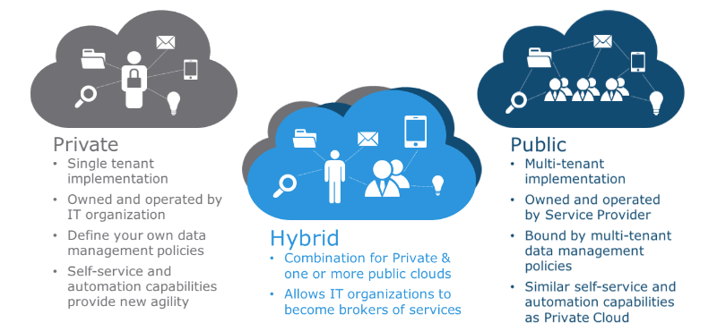
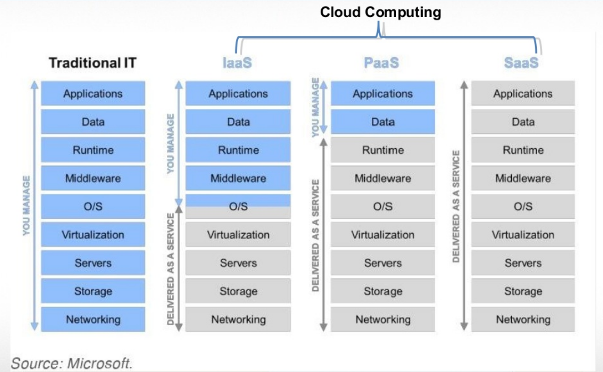
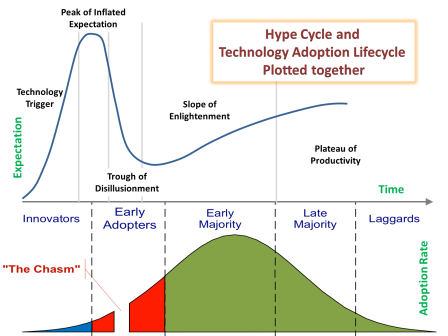
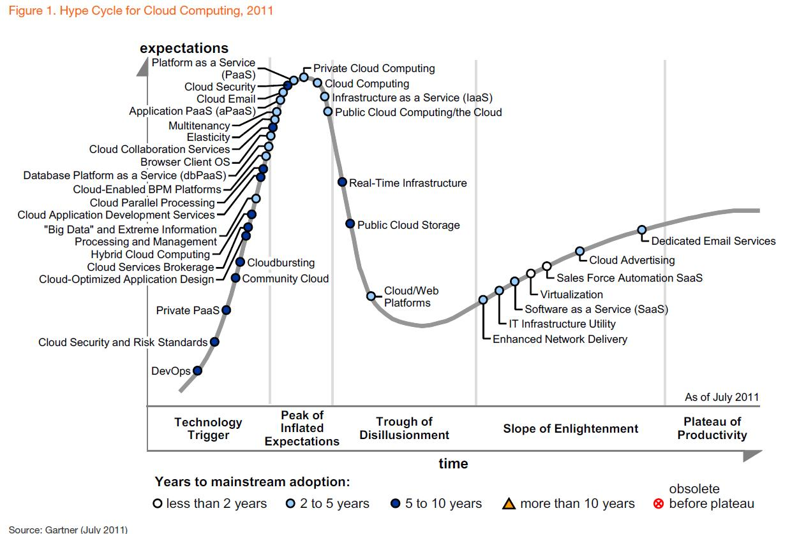
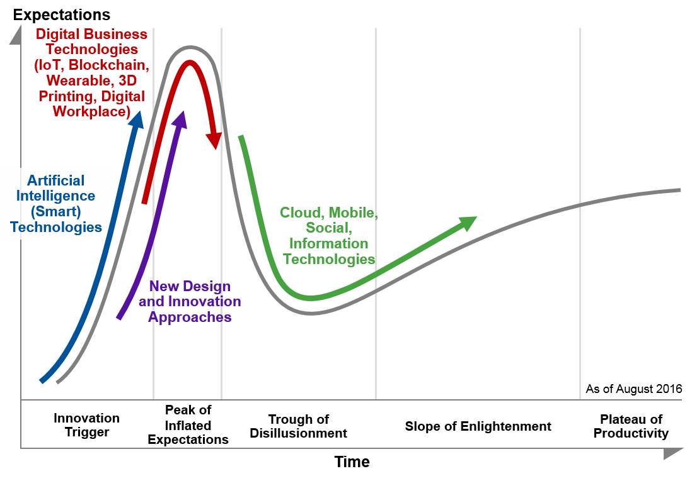
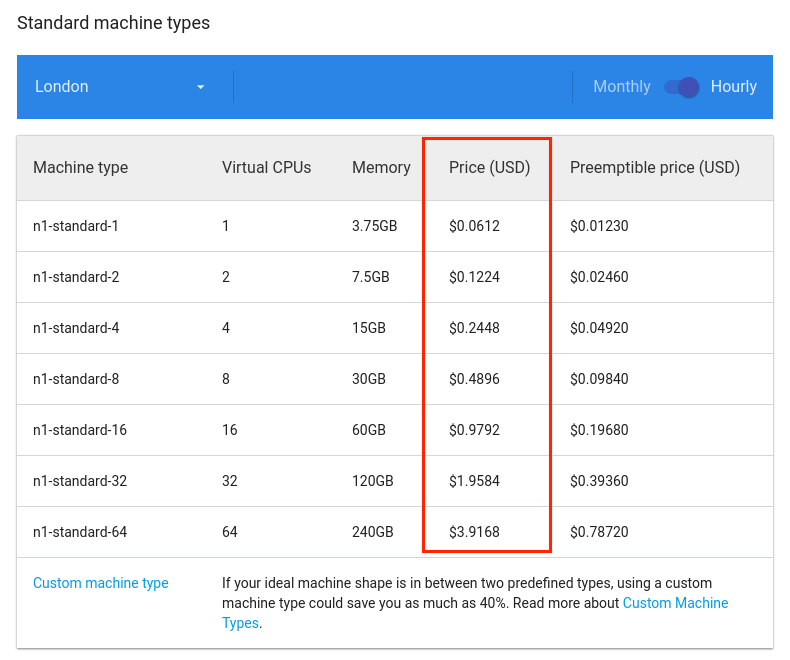
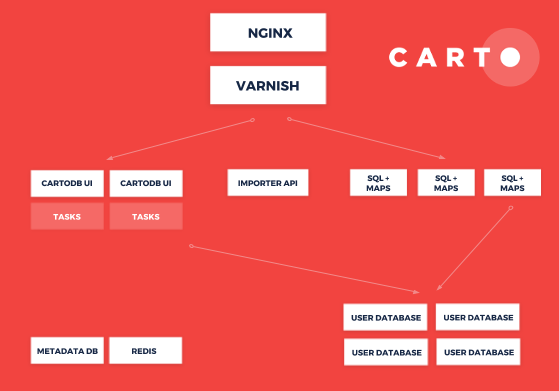
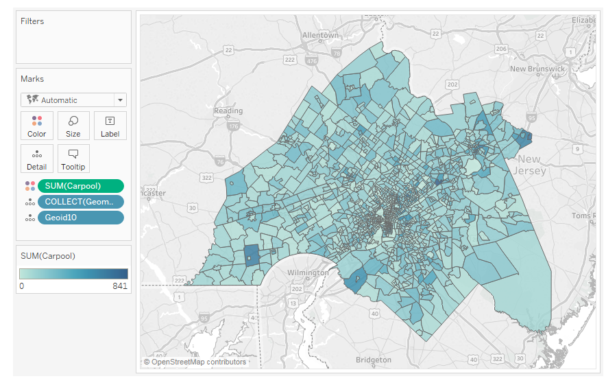
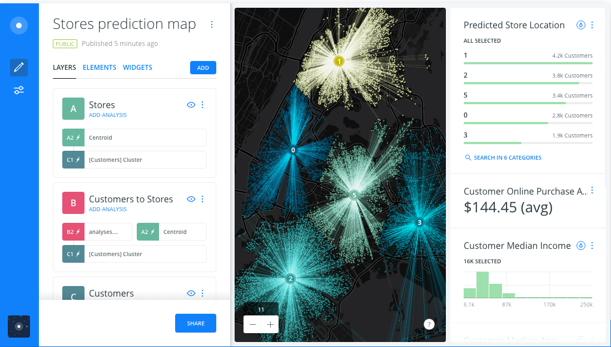

## Servicios en la nube para el desarrollo de aplicaciones geográficas

|   |   |
|:--|--:|
| `Espacio`, `Av. Pág` o `→` |  avanzar |
| `Re Pàg` o `←`             | retroceder  |
| `S`                        | notas |
| `Esc`                      | panorámica |
| `F`                        | pantalla completa |

---
<!-- .element data-background="imgs/u-lecture_sig-en-la-nube_2.png" class="only-background"-->

Note:

* Presentación
* Dónde trabajo y tal
* Profe del máster UNGIS

---
<!-- .element data-background="imgs/clouds/kaushik-panchal-37070.jpg" class="light-background"-->

## Agenda

* Introducción *cloud computing*
* Tipos de servicios, ejemplos geo
* Software GIS  como Servicio
* Conclusiones

Note:

La estructura de la charla es una primera introducción genérica a qué es el *cloud computing*, por qué es relevante y dos clasificaciones.

[Foto de Kaushik Panchal en Unsplash](https://unsplash.com/search/photos/cloud?photo=0juC5JIhPks)

---

## ¿Qué es el Cloud Computing?

> Obtención de **recursos** de computación **a demanda**, aprovisionados de forma **ágil** y con **mínimo esfuerzo**.

Note:

Llamamos *cloud computing* al conjunto de tecnologías que permiten acceder a recursos de computación de una forma ágil, rápida y de forma casi inmediata. El objetivo es reducir los tiempos de despliegue, pero también facilitar el acceso universal a estos recursos de la forma más eficiente posible. Se puede resumir con que se pretende optimizar al máximo la prestación de servicios relacionados con las tecnologías de la información.

---

## Por qué

* **Adaptación** de recursos a necesidades reales
* **Seguridad** y recuperación de back-ups  (para PYMES sobre todo)
* Facilidad de **actualización** de componentes
* Facilidad de **acceso** a recursos
* **Medio ambiente**

Note:

* Con la nube podemos adaptar los recursos a nuestra disposición a nuestras necesidades actuales y a corto plazo, de manera que si nuestras condiciones cambian podemos ampliar o reducir esos recursos de forma ágil.

* En las PYMES la entrada de las tecnologías en la nube ha facilitado el acceso a sistemas de *back-up* y recuperación de datos antes solo disponibles a grandes corporaciones con departamentos de sistemas capaces de gestionar este tipo de situaciones.

* En los servicios de *software* en la nube las actualizaciones (nuevas funcionalidades y también mejoras) se despliegan frecuentemente y quedan accesibles automáticamente. Por supuesto para nuevas versiones de APIs los desarrolladores tienen que migrar sus aplicaciones pero el ahorro de tiempo y costes es enorme.

* En los servicios en la nube los recursos (máquinas, software, bases de datos, documentos) son ubicuos, están disponibles a cualquier hora y en cualquier parte del mundo.

* Los recursos se gestionan en espacios que optimizan al máximo el consumo de energía, mucho más allá de lo que normalmente está disponible para centros de procesado de datos medianos o pequeños.

[Más sobre beneficios del cloud computing](https://www.salesforce.com/uk/blog/2015/11/why-move-to-the-cloud-10-benefits-of-cloud-computing.html)

---

## Tipos de nubes

Note:

* **Privadas**: las grandes agencias, pero también las organizaciones y empresas medianas están adoptando internamente en sus propios sistemas de información las tecnologías de la nube, que despliegan en sus propios centros de datos y les permite escalar servicios y recursos de forma ágil.

* **Públicas**: es la venta al por mayor de la computación. Grandes proveedores de servicios ponen toda su infraestructura al servicio del gran público desde los gobiernos y las grandes organizaciones a los emprendedores y estudiantes. Cualquiera puede abrir una cuenta en uno de estos proveedores y empezar a utilizar sus servicios inmediatamente.

* **Híbridas**: a medio camino muchas organizaciones mantienen datos sensibles dentro de sus propios recursos y explotan los bajos costes de las nubes públicas para aquellos datos derivados o agregados que ya no son tan sensibles.

[Fuente de la figura](https://www.linkedin.com/pulse/private-vs-public-hybrid-cloud-which-one-choose-ankur-minotra/)

---

## Tipos de servicios

Note:

En función del tipo de recurso de computación al que queremos acceder, los proveedores de computación en la nube nos ofrecen distintos tipos de servicios.

* En los sistemas de información tradicionales los técnicos de una organización se hacen cargo de todo el conjunto de hardware y software. Es decir se encargan de que todo el *hardware*: equipos, redes, copias de seguridad y virtualización funcione correctamente y sobre esos recursos se encargan de mantener el *software*: sistemas operativos, bases de datos, aplicaciones, etc.

* Si lo que queremos es disponer de servidores completos y virtualizados entonces necesitamos un proveedor de Infraestructura como Servicio (IaaS). Estos proveedores permiten encender y apagar servidores a demanda de todo tipo de tamaños. Pensemos por ejemplo en bancos levantando decenas de servidores que procesan nuestros datos de noche, cuando la demanda de hardware es menor y por tanto, más barata. Al llegar las horas de trabajo de esa zona el hardware se vuelve "mas caro" y las apagan hasta el día siguiente.

* Si no queremos preocuparnos de mantener servidores y solo queremos tener un lugar en el que desplegar nuestro *software* (por ejemplo un servidor de mapas o una base de datos) entonces tenemos que buscar un proveedor de Plataforma como Servicio (PaaS). Los proveedores nos dan un mecanismo sencillo para "desplegar" versiones de nuestro software de manera que automáticamente quedan a disposición de nuestros usuarios, sin tener que preocuparnos de mantener un sistema operativo concreto, o incluso el tamaño del dispositivo de almacenamiento. Si tenemos más usuarios, escalaremos la capacidad de nuestra plataforma para aceptar esa carga extra de tráfico.

* Si lo que queremos es simplemente acceder a un servicio ya desarrollado por un tercero y usarlo directamente bien como aplicaciones ya terminadas, bien como un conjunto de APIs sobre las que programar nuestras aplicaciones, entonces estamos hablando de un proveedor de un Software como Servicio (SaaS). Ejemplos clásicos de un SaaS son los proveedores de Correo Electrónico, donde nosotros directamente accedemos al servicio vía   web o bien a través de *software* en nuestros equipos que interactúa con el servidor mediante tecnologías y protocolos estándar.

[Fuente de la figura](https://www.slideshare.net/Skytapcontent/brett-goodwincampit-presentationbrettgoodwin040513final-22931204)

---

 ## *Hype curve*

 <!-- .element style="width:75%;" -->

Note:

La *hype curve* es una figura acuñada por la consultora *Gartner* en la que ante una nueva tecnología, el ciclo de adopción de la misma a lo largo del tiempo sufre subidas y bajadas muy características.

1. En una primera fase esta tecnología es adoptada de forma muy rápida por un grupo identificado como los Innovadores.
2. Cuando la tecnología llega al cenit de su visibilidad es cuando es ampliamente aceptada por los conocidos como *Early adopters*, aquellos que están siempre a última y se entusiasman rápidamente con cada nueva tecnología.
3. En general después llega la bajada de la desilusión, donde estos usuarios se dan realmente cuenta de las dificultades o implicaciones a medio plazo que implican adoptar esta nueva tecnología.
4. Ahí es donde empieza a realmente aprovecharse la tecnología de forma eficiente y adecuada para la mayoría de los casos y es cuando la misma está lista para ser usada por una mayoría de usuarios dispuestos a adoptar nuevas tecnologías.
5. Con el tiempo la tecnología se asienta y alcanza una aceptación mayoritaria, aquí deja de ser novedad y un segundo gran grupo de *Late Adopters* se anima a usarla.
6. Finalmente quedan aquellos usuarios más conservadores que cambian de tecnología con muy poca agilidad y que se verán casi forzados a adoptar estas tecnologías solo cuando ya la mayoría del mercado ha probado su eficiencia.

[Fuente de la figura](https://setandbma.wordpress.com/2012/05/28/technology-adoption-shift/)

---

## 2011

<!-- .element style="background:white;padding:25px" -->

Note:

Si miramos la curva de Gartner de 2011 para la computación en la nube vemos cómo, hace ya seis años:

* Los software como servicio (SaaS) y la virtualización ya estaban en fase de adopción mayoritaria
* El almacenamiento en la nube estaba en plena bajada del *hype*
* Las nubes privadas, el correo en la nube y el la plataforma como servicio (PaaS) estaban en el pico del *hype*
* Un gran número de tecnologías vinculadas a la nube estaban en el tren de la innovación

[Fuente de la figura](https://softwarestrategiesblog.com/2011/07/27/gartner-releases-their-hype-cycle-for-cloud-computing-2011/)
---

## 2016

<!-- .element style="background:white;padding:25px" -->

Note:

Pero si nos vamos a 2016, han pasado ya cinco años que es un mundo en este ámbito y ya hace tiempo que las tecnologías de la nube pasaron su pico y están la curva de adopción por el gran mercado.

Es decir el *cloud computing* ya no es una novedad para nadie, estamos en la época en la que el Internet de las Cosas, las criptomonedas, la impresión en 3D o los dispositivos incrustados en nuestra ropa están en lo alto del pico, la nube ya es parte de nuestra oferta y debemos aprovecharla.

[Fuente de la figura](http://www.project-consult.de/in_der_diskussion/gartner_hype_cycles_2016)

---
<!-- .element data-background="imgs/clouds/gabriela-parra-66015.jpg" class="light-background"-->

## Repasemos en detalle cada tipo de servicio

Note:

[Foto de Gabriela Parra en Unsplash](https://unsplash.com/search/photos/cloud?photo=BdQk6Qm3vAU)

---

## Proveedores de infraestructura

- Amazon EC2
- Google Compute Engine
- Microsoft Azure
- Digital Ocean

Note:

Los principales proveedores de infraestructura son Amazon, Google, Microsoft y Digital Ocean. Todos ellos proporcionan gran variedad de máquinas que arrancar con todo tipo de sistemas operativos y capacidades

---

## Google Compute Engine

Note:

En esta imagen vemos los precios de las máquinas estándar, hay otras con mayor capacidad de Memoria o CPU, o incluso de GPU.

https://cloud.google.com/compute/pricing

---

Note:

En esta pantalla vemos la configuración de un potente servidor con 16 CPUs, 60 GB de RAM, 40GB de disco duro SSD y Debian 9. El coste es de unos 70 céntimos de dolar por hora.

Lo mejor es que al estar en la nube solo pagamos por el tiempo que lo tenemos encendido por lo que si lo usamos por ejemplo para procesar datos durante nuestra jornada laboral podría costarnos unos 100 dólares al mes como mucho. Y si nos quedamos cortos o nuestro proyecto cambia podemos cambiar las características de la máquina, lo que se conoce como **escalado vertical**.

https://cloud.google.com/compute/

---

## Casos de uso

* Nuestro proyecto utiliza  configuraciones no estándar
* Servidores para propósitos concretos o *de usar y tirar*

---

<!-- .element class="only-background"-->

Note:

En CARTO usamos el IaaS de Amazon, Google y Digital Ocean ya que toda nuestra plataforma se ejecuta sobre servidores que necesitamos controlar.

Otro caso típico es cuando necesitamos procesar un gran conjunto de datos para alguna tarea concreta y nuestros equipos de trabajo se quedan cortos. En esos casos levantamos un servidor muy potente, le cargamos los datos, los procesamos, nos descargamos los resultados y lo cerramos.

---

## Plataforma

- Heroku
- Amazon Beanstalk
- Google App Engine
- Open Shift
- Cloud Foundry

Note:

Este modelo permite subir aplicaciones completas, normalmente conectadas a servicios incluidos de bases de datos (relacionales o de tipo NSQL). Se trata de aplicaciones convencionales como puede ser un gestor de contenidos o un servidor de mapas, es decir aplicaciones de tamaño considerable.

Estos sistemas se caracterizan por facilitar de forma considerable el despliegue de las aplicaciones a los responsables de sistemas. En general trabajan directamente contra el sistema de control de versiones y mediante automatizaciones generan los recursos que se acaban desplegando en la nube.

---

## Mínima expresión: *Serverless*

- Amazon Lambda
- Google Cloud Functions
- Microsoft Azure Functions
- IBM OpenWhisk

Note:

En los últimos años se han unido dos situaciones:

* por un lado la mejora de tecnologías vinculadas a la virtualización de recursos (los conocidos como contenedores)
* por otro la adopción de una forma de estructurar las aplicaciones en unidades mínimas que proporcionan funcionalidad conocidas como **microservicios**.

La unión de estas dos situaciones ha provocado el auge de un tipo nuevo de servicio, las Funciones como Servicio. Esto no es más que un servicio que permite subir una función que realiza una única tarea. Esta función *vive* en un entorno que solo está encendido mientras la función es invocada y no guarda ningún estado, simplemente se levanta, ejecuta algo y muere.

---

Note:

Podemos incluso escribir el código de nuestra función directamente en la web del proveedor!

---

## Casos de uso

* Desarrollamos nuestro software
* Necesitamos poder escalar a demanda

---

## AWS Lambda para crear mapa de *tweets*

* Una función **Lambda** recoge 
  los últimos **10 minutos** de tweets
* Los procesa y los sube a una tabla en **CARTO**
* El mapa renderizará esos datos automáticamente
* Ventajas:
  * **Coste**: ~30 segundos cada 10 minutos
  * El **estado** se almacena en CARTO
  * **Monitorización** integrada

Note:

En el equipo de soluciones de CARTO solemos hacer mapas de *tweets* varias veces al año. Antes teníamos un servidor en el que desplegábamos una aplicación que teníamos que poner en marcha y monitorizar de forma muy manual.

Desde hace un año más o menos venimos desplegando una función de Lambda que programamos para que se ejecute cada pocos minutos (5 o 10) y que se encarga de recoger los últimos *tweets* y subirlos a una tabla de CARTO. Usamos otra tabla para almacenar el estado de manera que entre una ejecución y la siguiente no es necesario mantener nada más.

Esto nos ha permitido olvidarnos de un servidor y ciertamente descansar más porque estos mapas solían ser en fin de semana!

---
<!-- .element data-background="imgs/superbowl.png" class="only-background"-->

Note:

[Visor de la SuperBowl 50](https://cartodb.github.io/labs-twitter-superbowl50/)

---

## Generación de teselas

[<!-- .element style="max-width:80%"-->](http://maps.stamen.com/terrain/#13/27.6680/85.2863)

Note:

Otro ejemplo interesante es el desarrollo de la empresa de San Francisco Stamen. Su desarrollo es *Open Source* y se pueden consultar más detalles [en el siguiente enlace](https://hi.stamen.com/stamen-aws-lambda-tiler-blog-post-76fc1138a145) en el que explican los pasos necesarios para desplegar esta arquitectura, que es ciertamente compleja pero preparada para servir teselas de terreno a escala global.

---

## SaaS

* Es la forma más **común** de consumo 
  de servicios para el **gran público**
* Hay servicios enfocados tanto 
  a **usuarios** como a **desarrolladores**

---
<!-- .element data-background="imgs/clouds/dominik-kiss-341291.jpg" class="light-background"-->

## Proveedores de  servicios GIS

Note:

[Foto de Dominik Kiss en Unsplash](https://unsplash.com/search/photos/cloud?photo=JN7TZEsKaUM)
---

## Dispositivos móviles

Fulcrum[»](http://www.fulcrumapp.com/)  GIS Cloud[»](http://www.giscloud.com) ArcGIS Apps[»](http://www.arcgis.com/features/apps/index.html)   CARTO Mobile SDK[»](https://carto.com/engine/mobile/) Mapbox Mobile SDK[»](https://www.mapbox.com/mobile/)  Google Maps[»](https://developers.google.com/maps/get-started/)

Note:

Tanto Fulcrum como GIS Cloud y algunas de las aplicaciones de ArcGIS Apps son herramientas que permiten desplegar rápidamente aplicaciones de recolección de datos con detección de la posición, formularios personalizados, visualización de las entradas, etc.

Por otro lado, Google, ESRI, CARTO y Mapbox disponen de kits de desarrollo para aplicaciones móviles.

---

## Raster

Digital Globe GBDX[»](https://platform.digitalglobe.com/gbdx/) Planet[»](https://www.planet.com/products/developer-program/)   Descartes Labs[»](https://www.descarteslabs.com/)  Raster Foundry[»](https://www.rasterfoundry.com/)

<!-- .element style="max-width:300px;" -->

Note:

Todos estos servicios nos ofrecen APIs para acceder a enormes catálogos de imágenes, muchas de ellas de acceso público como las imágenes Landsat o Sentinel.

Pero estos servicios van más allá de la renderización de imágenes. Digital Globe y Raster Foundry permiten ejecutar algoritmos personalizados, Planet permite explorar cambios a lo largo del tiempo gracias a la enorme precisión temporal de sus microsatélites y Descartes ofrece algoritmos de predicción agronómica.

[Fuente de la figura](https://www.rasterfoundry.com/)

---

## Location Based Services

Mapas base, rutas y geocodificación

Mapzen[»](https://mapzen.com/products/) Mapbox[»](https://www.mapbox.com/products/) Google[»](https://developers.google.com/maps/) HERE[»](https://developer.here.com/documentation) Esri[»](http://www.esri.com/software/arcgis/arcgisonline/features/maps) CARTO[»](https://carto.com/location-data-services/)

Note:

Los mapas base son una parte básica de cualquier aplicación geográfica. Todos estos proveedores permiten acceder a mapas base de forma sencilla y a un precio muy bajo o incluso gratuito.

Hace tiempo que Google o HERE dejaron de ser los únicos proveedores de mapas base. Gracias al trabajo de la comunidad OpenStreetMap, Mapbox y Mapzen ofrecen detallados mapas base a los que además permiten personalizar los estilos gracias al uso de teselas vectoriales. El estudio para diseño de mapas base de Mapbox es sencillamente el mejor del mercado.

Del mismo modo, los servicios para geocodificar direcciones y rutas entre dos o más puntos se basan en esta misma cartografía base, por lo que todos estos proveedores han desarrollado servicios asociados. Del mismo modo Google y HERE basan sus servicios en sus bases de datos propias mientras que Mapzen y Mapbox utilizan OSM.

CARTO aquí juega un papel distinto, ya que si bien sus mapas base utilizan OSM por defecto, en realidad se pueden utilizar también los mapas base de Google y HERE y de forma transparente utiliza los servicios de geocodificación y routing de Mapzen o HERE dependiendo del tipo de usuario.

[Figura extraída de la web de Mapbox](https://www.mapbox.com/maps/)

---

## Business Intelligence

MapD [»](https://www.mapd.com/) Qlik [»](http://help.qlik.com/en-US/sense/June2017/Subsystems/Hub/Content/Visualizations/Map/map.htm) Tableau [»](https://www.tableau.com/products/cloud-bi)

<!-- .element style="max-width:60%;" -->

Note:

Qlik y Tableau son herramientas clásicas de análisis de datos alfanuméricos que en los últimos años han ido incorporando capacidades geoespaciales. MapD por otro lado es un nuevo tipo de herramienta que utilizando las capacidades de los procesadores gráficos permite procesar grandes volúmenes de datos para poder implementar cuadros de mando.

---

##  Análisis y visualización

GIS Cloud [»](http://www.giscloud.com/apps/map-editor) ArcGIS online [»](http://www.esri.com/software/arcgis/arcgisonline/features/visualization) CARTO [»](https://carto.com/builder/)

Note:

Si pensamos en lo que se podía hacer en un navegador web hace unos 5 o 6 años y lo que es posible hacer hoy en día... tal y como está ocurriendo con otros sectores como la ofimática, el rango de casos de uso para necesitar una aplicación de escritorio es cada vez más reducido. Es decir, es más factible dejar de lado los SIG de escritorio tradicionales y llevar a cabo todo tipo de procesos en las herramientas web que estos proveedores nos ofrecen.

Del mismo modo es posible no solo utilizar estas estupendas aplicaciones web sino también sacar provecho de los *kits* de desarrollo que ofrecen para ir más allá de las interfaces que ofrecen para adaptarnos mejor a los requerimientos de nuestros casos de uso.

---
<!-- .element data-background="imgs/clouds/quino-al-178458.jpg" class="light-background"-->

## Vamos a ir acabando

Note:

[Foto de Quino Al en Unsplash](https://unsplash.com/search/photos/dawn?photo=7cjDM0QBssc)

---

## Tipos de servicios revisados

* Aplicaciones móviles
* Gestión de datos Raster
* Location Based Services
* Business Intelligence
* Análisis y visualización

Note:

Como vemos, existe gran variedad de casos de uso y escenarios en el ámbito del desarrollo de aplicaciones geoespaciales. Del mismo modo la industria está en continuo desarrollo y la variedad de proveedores de servicios es muy alta por lo que debemos prepararnos para tomar decisiones de una forma lo más informada posible. Vamos a ver algunos criterios para la elección de servicios.

---

## ¿Cómo elegir un servicio? I

> No hay una única respuesta, pero hay diversos **aspectos** a los que debemos prestar atención, según las **características** de nuestro proyecto

---

## ¿Cómo elegir un servicio? II

* Opciones de **escalado**
* **Integraciones** con nuestros sistemas
  * autenticación, bases de datos, ...
* Soporte de **estándares**
* Pensar en una salida:
  * **Migración** de datos
  * Podemos evitar el *vendor locking*  apostando por el **Open Source**

---

## ¿Cómo elegir un servicio? III

* Nube pública vs privada (**On-Premises**)
* Modelo de **precios**
  * planes a medio plazo, descuentos
* Planes de **Soporte**
* Acuerdos de **calidad de servicio**
* **Documentación** existente y nivel de actividad  de sus comunidades de **desarrolladores**

---

## ¿Preguntas?

* http://bit.ly/1709-giscloud
* <!-- .element class="logo" --> @xurxosanz
* <!-- .element class="logo" --> <!-- .element class="logo" --> @jsanz

[ <!-- .element style="background:white;" -->](http://www.unigis.es/)
